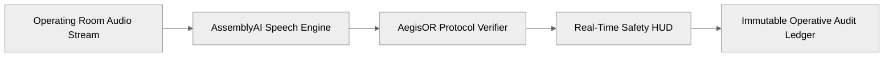
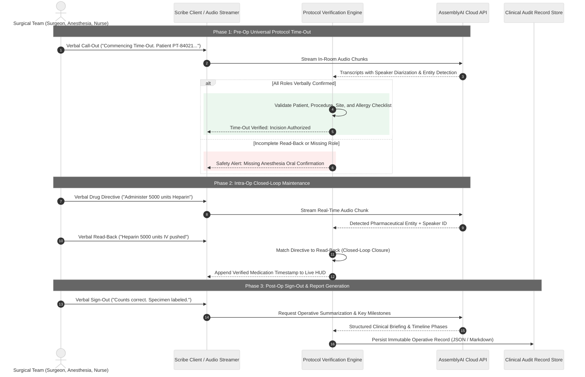
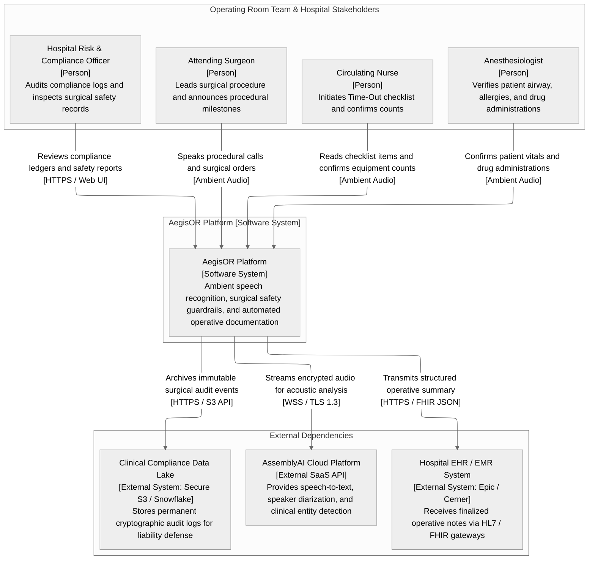
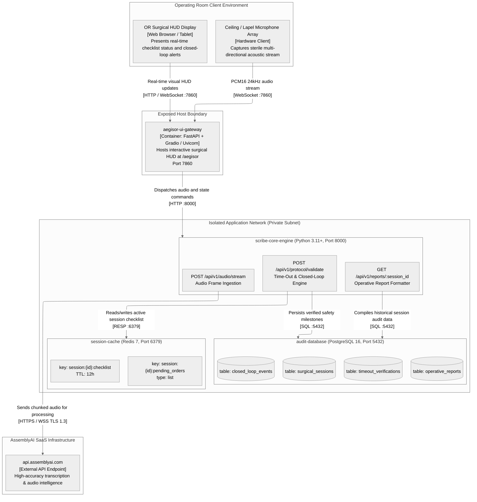
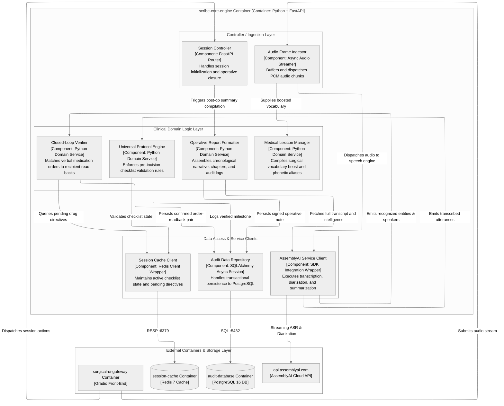

# AegisOR

> Autonomous ambient clinical intelligence system and surgical safety guardrail enforcing The Universal Protocol and Closed-Loop Communication in sterile operating room environments using AssemblyAI.


AegisOR is an ambient clinical intelligence engine and surgical safety guardrail that listens to operating room communications, validates surgical safety checklists in real time, and produces structured, immutable operative records.

---

## 1. End-to-End Pipeline Overview



---

## 2. Core Purpose & Business Value

AegisOR transforms surgical room audio into an active patient safety barrier and automated clinical record, safeguarding healthcare institutions from preventable surgical errors while alleviating cognitive exhaustion for clinical staff.

- **Zero Never Events**: Prevents wrong-patient, wrong-site, and wrong-procedure surgeries by enforcing mandatory verbal verification across surgical disciplines prior to incision.
- **Automated Medicolegal Protection**: Produces an incontrovertible acoustic audit log verifying adherence to patient safety protocols, shielding hospitals from costly malpractice claims.
- **Uncompromised Surgical Focus**: Eliminates manual keyboard and computer interactions during procedures, allowing surgical teams to concentrate entirely on patient care.
- **Regulatory Accreditation Compliance**: Guarantees adherence to Joint Commission and World Health Organization surgical safety standards without introducing procedural delays.
- **Optimized Operating Room Turnover**: Accelerates postoperative documentation and phase transitions, improving procedural capacity and reducing hospital overhead.

---

## 3. Functional & Non-Functional Requirements

### Functional Requirements (FR)

- **FR-1 (Acoustic Ingestion & Diarization)**: Ingest multi-channel operating room audio streams, apply surgical acoustic vocabulary boosting, and perform multi-speaker diarization to distinguish the primary surgeon, anesthesiologist, and circulating nurse.
- **FR-2 (Pre-Operative Time-Out Verification)**: Automatically detect and validate mandatory Universal Protocol checklist items (patient identity, planned procedure, operative site/side, informed consent, allergy confirmation, and antibiotic prophylaxis status) before incision authorization.
- **FR-3 (Intra-Operative Closed-Loop Tracking)**: Capture critical verbal directives (medication administrations, blood loss estimations, sponge/needle counts) and match them against explicit verbal read-backs to enforce closed-loop communication closure.
- **FR-4 (Post-Operative Sign-Out & Reporting)**: Aggregate surgical milestones, instrument count verifications, specimen labels, and clinical summaries into a standardized, timestamped operative report ready for electronic medical record integration.

### Non-Functional Requirements (NFR)

- **NFR-1 (Performance & Latency)**: Audio chunk transcription p95 latency <= 500ms; closed-loop order-readback reconciliation latency p95 <= 250ms under continuous acoustic streaming.
- **NFR-2 (Reliability & Fail-Safe Operation)**: 99.99% operational uptime during active surgical sessions; zero audio frame loss via ring-buffered local fallback during temporary network disconnections.
- **NFR-3 (Security & HIPAA Compliance)**: Strict HIPAA-compliant data handling; all data in transit encrypted using TLS 1.3; all persisted surgical audit ledgers encrypted at rest using AES-256; zero local retention of unencrypted raw patient identifiable audio.
- **NFR-4 (Scalability & Isolation)**: Stateless processing core capable of isolating concurrent operating room sessions across multiple surgical suites with zero shared-memory leakage.

---

## 4. System Architecture & Technical Execution

The platform establishes an ambient intelligence loop over three sequential surgical phases: Pre-Operative Time-Out, Intra-Operative Closed-Loop Maintenance, and Post-Operative Sign-Out.

### Core Concept & Phased Execution Sequence



### C1: System Context Diagram



### C2: Container Diagram



### C3: Component Diagram



> [!NOTE]
> **C4: Code Diagram (Intentionally Omitted)**: Level 4 (Code/Class) diagrams are intentionally omitted from README documentation to prevent high maintenance overhead and rapid obsolescence. Detailed code structures are documented via inline docstrings, type annotations, and module unit tests.

---

## 5. Repository Structure

```text
AegisOR/
├── src/
│   ├── __init__.py           # Source package exports
│   ├── app.py                # FastAPI server & Gradio mounting
│   ├── assembly_service.py   # AssemblyAI client & acoustic lexicon priming
│   ├── engine.py             # Protocol state machine & closed-loop matcher
│   ├── models.py             # Domain models, checklists, and report schemas
│   ├── samples.py            # Dedicated clinical scenario texts & mock data
│   └── ui/                   # Modular presentation layer
│       ├── __init__.py       # Exposes build_ui
│       ├── handlers.py       # TimeOut, IntraOp, and PostOp event handlers
│       └── layout.py         # Gradio tabbed blocks interface layout
├── tests/
│   ├── __init__.py
│   ├── integration/          # Integration workflow tests
│   │   ├── __init__.py
│   │   └── it_workflow.py
│   └── unit/                 # Isolated domain logic unit tests
│       ├── __init__.py
│       ├── ut_assembly_service.py
│       ├── ut_engine.py
│       └── ut_models.py
├── .env                      # Local AssemblyAI API credentials
├── .env.example              # Environment configuration template
├── .gitignore                # Git exclusion rules
├── README.md                 # System architecture and operational manual
├── app.py                    # Root entrypoint launcher delegating to src.app
├── requirements.txt          # Python dependencies (assemblyai, gradio, python-dotenv)
├── run.bat                   # Windows Explorer one-click execution script
└── run.sh                    # Bash execution script with ANSI logging
```

---

## 6. Getting Started

### Prerequisites

- Python 3.10 or higher
- `uv` package manager (recommended) or standard `pip`
- Valid AssemblyAI API key

### Installation & Configuration

1. Clone or navigate to the workspace directory:
   ```bash
   cd c:\Users\boyce\OneDrive\Desktop\ReAct_Demo
   ```

2. Configure environment credentials in `.env`:
   ```env
   assembly_ai_api=your_assemblyai_api_key_here
   ```

3. Install dependencies:
   ```bash
   uv pip install -r requirements.txt
   ```

4. Run test suite:
   ```bash
   uv run python -m unittest discover -s tests -p "*_*.py"
   ```

5. Launch the application:
   ```bash
   ./run.sh
   ```
   *On Windows, you can alternatively execute `run.bat` or run:*
   ```bash
   uv run gradio app.py
   ```

6. Access the AegisOR clinical HUD at `http://127.0.0.1:7860/aegisor` (or root `http://127.0.0.1:7860/` which redirects to `/aegisor`).

